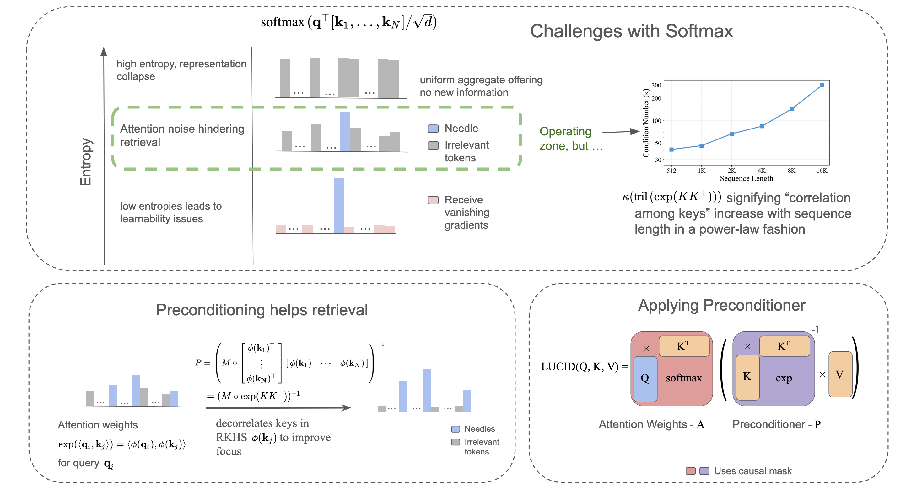
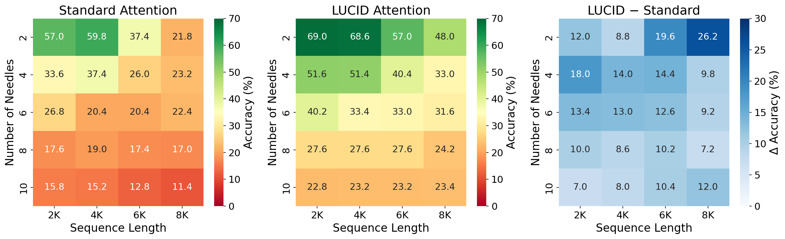

# LUCID: Attention with Preconditioned Representations

[](https://arxiv.org/abs/2602.10410)
[](https://www.python.org/downloads/)
[](LICENSE)

LUCID improves how language models retrieve information from long documents. Standard attention struggles with long sequences because it spreads focus across irrelevant tokens -- a problem that gets worse as context grows. LUCID fixes this by adding a correction step that sharpens attention on the tokens that actually matter, with almost no extra cost.

<p align="center">
  
</p>

## How It Works

In standard attention, as sequences get longer, keys become increasingly correlated. This correlation creates noise that makes it harder to find the right information (like finding a needle in a haystack).

LUCID adds a **preconditioner** -- a correction matrix built from key-key similarities -- that removes this correlation. Think of it like noise cancellation for attention:

1. **Standard attention** computes: `softmax(QK^T) * V`
2. **LUCID attention** computes: `softmax(QK^T) * P^{-1} * V`

where `P` is a lower-triangular matrix derived from key similarities. This is efficiently computed via triangular solve (a well-optimized operation on GPUs).

**The result:** LUCID achieves precise retrieval similar to very sharp (low-temperature) attention, while maintaining healthy gradients for learning -- something standard attention cannot do simultaneously.

## Results

LUCID consistently outperforms standard attention on multi-needle retrieval tasks, with the gap widening at longer sequences and more needles:

<p align="center">
  
</p>

**Highlights:**
- **+18%** on BABILong long-context reasoning (32K-128K tokens)
- **+14%** on RULER multi-needle retrieval
- **0-5.5%** training overhead vs standard attention
- **~1.3%** inference overhead at 32K context

## Installation

### 1. Clone LUCID and install Python dependencies

```bash
git clone https://github.com/saisuryadv/LUCID.git
cd LUCID

python -m venv lucid-env
source lucid-env/bin/activate

pip install -r requirements.txt
```

### 2. Install the Transformers fork (required)

LUCID's model implementation (`modeling_lucid.py`) uses internal Transformers imports and must be installed inside a Transformers source tree. The training scripts also reference `run_clm.py` from the Transformers examples. You need our forked version:

```bash
# Clone the LUCID transformers fork (one level up, or wherever you prefer)
git clone https://github.com/saisuryadv/transformers.git
cd transformers
pip install -e .
cd ..
```

Then copy the model file into the Transformers source tree:

```bash
cp modeling_lucid.py transformers/src/transformers/models/llama/modeling_lucid.py
```

### 3. Install flash-linear-attention (required for LUCID-Path)

If you plan to use the LUCID-Path variant, you need `flash-linear-attention` installed from source with the custom Triton kernels symlinked in:

```bash
git clone https://github.com/sustcsonglin/flash-linear-attention.git
cd flash-linear-attention
pip install -e .
cd ..

# Symlink LUCID's custom Triton kernels into fla
ln -s $(pwd)/LUCID/lucid_path/triton_code \
      flash-linear-attention/fla/ops/lucid_path
```

> **Note:** Do not install `flash-linear-attention` from PyPI — the pip package does not include the extension points LUCID-Path requires.

### 4. flash-attn build note (aarch64 / GH200 systems)

On systems like TACC Vista where the default gcc may be too new for CUDA, you may need to specify an older compiler:

```bash
CC=/path/to/gcc-14 CXX=/path/to/g++-14 CUDAHOSTCXX=/path/to/g++-14 \
  pip install flash-attn --no-build-isolation
```

**Core dependencies:** PyTorch 2.0+, Transformers (forked), Flash Attention 2, Triton, flash-linear-attention, lm-eval-harness

> **TACC Vista users:** See [TACC_SETUP.md](TACC_SETUP.md) for a complete guide covering module setup, gcc workarounds, filesystem layout, and SLURM partitions.

## Project Structure

```
LUCID/
├── modeling_lucid.py              # Core LUCID attention implementation
├── run_clm_chunk.py               # Training script
├── requirements.txt
│
├── lucid/                         # LUCID variant
│   ├── config/                    # Model & tokenizer configs
│   ├── train_lucid.slurm          # Pre-training
│   ├── finetune/                  # Fine-tuning (LongBench, SCROLLS)
│   └── evaluation/                # Eval (MNIAH, RULER, LongBench)
│
├── lucid_path/                    # LUCID-Path variant (extended contexts)
│   ├── config/                    # Model & tokenizer configs
│   ├── triton_code/               # Custom Triton GPU kernels
│   ├── train_lucid_path.slurm     # Pre-training
│   ├── finetune/                  # Fine-tuning (BABILong, LongBench, SCROLLS)
│   └── evaluation/                # Eval (BABILong, SCROLLS)
│
├── lm_eval_ruler/                 # RULER benchmark task definitions
└── datasets/                      # Dataset download scripts
```

## Setup Verification

Run a quick smoke test to confirm everything is installed correctly. This trains for 5 steps on a small dataset and should complete in under a minute on a GPU node:

```bash
WANDB_DISABLED=true python transformers/examples/pytorch/language-modeling/run_clm.py \
  --model_type lucid \
  --config_name lucid/config \
  --tokenizer_name lucid/config \
  --dataset_name wikitext --dataset_config_name wikitext-2-raw-v1 \
  --do_train --output_dir ./test_output \
  --per_device_train_batch_size 1 --max_steps 5 \
  --block_size 512 --overwrite_output_dir --report_to none
```

If training completes and you see a loss decreasing over the 5 steps, your setup is working.

## Datasets

```bash
# Dolma (pre-training, ~6.5B tokens)
python datasets/dolma/download_dolma.py --output_dir ./data/dolma

# BABILong (evaluation)
python datasets/download_babilong.py --output_dir ./data/babilong

# SCROLLS (fine-tuning & evaluation)
python datasets/download_scrolls.py --output_dir ./data/scrolls

# LongBench (fine-tuning)
python datasets/download_longbench.py --tokenizer_path <your-tokenizer> --output_dir ./data/longbench
```

## Training

All training uses SLURM. Before running, update the placeholder values in each script:
- `<PATH_TO_LUCID>`, `<ALLOC>`, `<PARTITION>`, `<EMAIL>`

> **Note:** Some SLURM scripts also contain internal directory names (e.g., `oglucid_no_qknorm_directory`) that may not match your directory structure. Review and update these paths to match your actual layout (e.g., `lucid/config/` for the model config directory).

**Weights & Biases:** Training scripts default to logging with wandb. Either run `wandb login` before training, or disable it by adding `--report_to none` to the training command (or setting `WANDB_DISABLED=true`).

```bash
# LUCID pre-training (16 nodes)
sbatch lucid/train_lucid.slurm

# LUCID-Path pre-training (32 nodes)
sbatch lucid_path/train_lucid_path.slurm
```

## Fine-tuning

```bash
# LUCID on LongBench / SCROLLS
sbatch lucid/finetune/finetune_longbench.slurm
sbatch lucid/finetune/finetune_scrolls.slurm

# LUCID-Path on BABILong / LongBench / SCROLLS
sbatch lucid_path/finetune/finetune_babilong.slurm
sbatch lucid_path/finetune/finetune_longbench.slurm
sbatch lucid_path/finetune/scrolls/finetune_qasper.slurm
sbatch lucid_path/finetune/scrolls/finetune_qmsum.slurm
```

## Evaluation

All evaluations use [lm-eval-harness](https://github.com/EleutherAI/lm-evaluation-harness). Update model path placeholders before running.

```bash
# LUCID -- MNIAH, RULER, LongBench
bash lucid/evaluation/mniah/varying_needles/submit.sh
bash lucid/evaluation/ruler/submit.sh
bash lucid/evaluation/longbench/submit.sh

# LUCID-Path -- BABILong, SCROLLS
bash lucid_path/evaluation/babilong/submit.sh
bash lucid_path/evaluation/scrolls/submit.sh
```

## Citation

```bibtex
@article{duvvuri2026lucid,
  title={LUCID: Attention with Preconditioned Representations},
  author={Duvvuri, Sai Surya and Patel, Nirmal and Gupta, Nilesh and Dhillon, Inderjit S.},
  year={2026}
}
```

